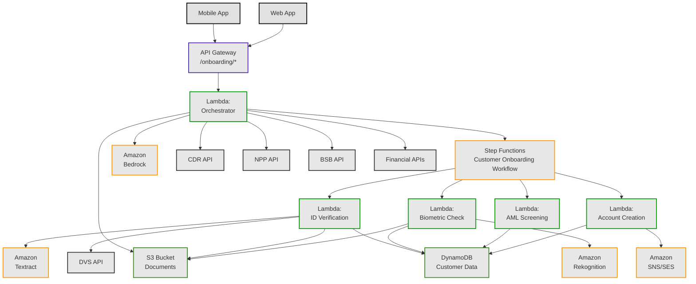

# Customer Onboarding Solution with AWS

This project implements a serverless customer onboarding system for a bank using AWS services and Terraform. The system automates the entire customer onboarding process, from initial application to account creation, with robust identity verification, biometric authentication, financial data verification, and AML/CTF compliance checks.

## Architecture Overview



## Components

### Core AWS Resources
- **API Gateway**: HTTP API serving as the entry point for all onboarding operations
- **Step Functions**: State machine orchestrating the end-to-end onboarding workflow
- **Lambda Functions**: Serverless functions processing each step of the onboarding process
- **DynamoDB**: NoSQL database storing customer, account, and onboarding process data
- **S3**: Object storage for identity documents and selfie images
- **Bedrock**: AI service for generating personalized messages and recommendations
- **Textract**: Document analysis for extracting text from ID documents
- **Rekognition**: Facial recognition for biometric verification
- **SNS/SES**: Notification services for alerts and customer communications

### Lambda Functions
- **Orchestrator**: Central function handling API requests and orchestrating the workflow
- **ID Verification**: Processes and verifies government-issued ID documents
- **Biometric Check**: Performs facial recognition and liveness detection
- **AML Screening**: Conducts anti-money laundering and counter-terrorism financing checks
- **Account Creation**: Creates the bank account and sends welcome notifications

### Third-Party API Integrations
- **Document Verification Service (DVS)**: Validates ID documents against government records
- **Consumer Data Right (CDR) API**: Accesses financial data with customer consent
- **New Payments Platform (NPP) API**: Verifies payment capabilities
- **BSB Lookup API**: Validates bank state branch codes
- **Financial Data Aggregators**: Yodlee, Illion BankStatements, and Basiq for financial verification

## Getting Started

### Prerequisites
- AWS Account with appropriate permissions
- Terraform (version 1.2.0 or higher)
- AWS CLI configured with appropriate credentials
- Third-party API access credentials

### Deployment

1. Clone this repository:
   ```
   git clone https://github.com/jignesh88/customer-onboarding-alpha.git
   cd customer-onboarding-alpha
   ```

2. Create a `terraform.tfvars` file with your specific settings:
   ```
   aws_region         = "ap-southeast-2"
   project_prefix     = "your-bank-onboarding"
   environment        = "dev"
   notification_email = "admin@your-bank.com"
   # Add third-party API keys (or use AWS Secrets Manager)
   ```

3. Package the Lambda functions before deployment:
   ```
   # Create zip files for each Lambda function
   mkdir -p lambda
   cd lambda/orchestrator
   npm install
   zip -r ../../lambda/orchestrator.zip .
   cd ../../lambda/id_verification
   # Repeat for other Lambda functions
   ```

4. Initialize and apply Terraform:
   ```
   terraform init
   terraform plan
   terraform apply
   ```

5. Note the outputs, including the API Gateway endpoint URL:
   ```
   API Endpoint: https://xxx.execute-api.ap-southeast-2.amazonaws.com/dev
   ```

## Onboarding Workflow

1. **Initiate Onboarding**: The customer starts the process through the bank's app or website.

2. **Personal Information Collection**: Basic details like name, address, date of birth are collected.

3. **Identity Verification**: Customer uploads an ID document, which is verified using Amazon Textract and a Document Verification Service.

4. **Biometric Authentication**: Customer takes a selfie, which is compared with the ID photo using Amazon Rekognition.

5. **Financial Data Verification**: With the customer's consent, financial data is collected and verified using CDR and other financial APIs.

6. **AML/CTF Screening**: Customer is screened against watchlists and sanctions lists.

7. **Account Creation**: Once all verifications pass, a bank account is created and the customer is notified.

## API Endpoints

- `POST /onboarding/init`: Start a new onboarding process
- `POST /onboarding/details`: Submit customer personal details
- `POST /onboarding/id`: Upload ID document
- `POST /onboarding/selfie`: Upload selfie for biometric verification
- `POST /onboarding/cdr-consent`: Provide consent for financial data access

## Security and Compliance

This implementation is designed to help meet regulatory requirements including:

- Know Your Customer (KYC)
- Anti-Money Laundering (AML)
- Counter-Terrorism Financing (CTF)
- Consumer Data Right (CDR) compliance
- Banking regulations specific to the operating jurisdiction

## License

This project is licensed under the MIT License - see the LICENSE file for details.
